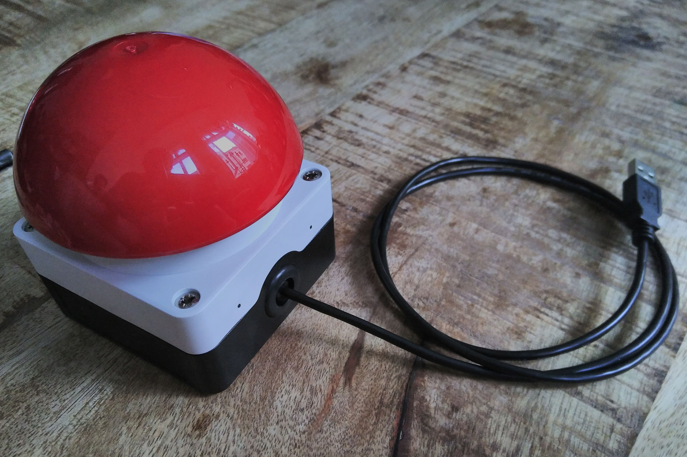

<p align="center">
    
</p>
<h1 align="center"><a href="http://keeporsweep.net">Keep or Sweep</a></h1>
<p align="center">Randomly declutter your digital life!<p>
<p align="center">
    
</p>

<p><strong>Tech companies help you amass data – we help you clean it by having fun while getting things done! 😊</strong> You will see one random element of your data at a time and you decide whether to ✅keep or ❌sweep it.</p>


<h2>Install</h2>

<p>Download for <a href="https://github.com/keeporsweep/keeporsweep-desktop/releases/download/v0.1.0/Keep-or-Sweep.exe">⊞Windows</a>, <a href="https://github.com/keeporsweep/keeporsweep-desktop/releases/download/v0.1.0/Keep-or-Sweep.app.zip">🍏macOS</a> & <a href="https://github.com/keeporsweep/keeporsweep-desktop/releases/download/v0.1.0/Keep-or-Sweep-Linux.Sweep">🐧Linux</a>. And if you like it, <a href="https://github.com/keeporsweep/keeporsweep-desktop">come contribute</a>!</p>

<p>Also available as <a href="https://apps.nextcloud.com/apps/keeporsweep">☁️Nextcloud app</a> – <a href="https://github.com/keeporsweep/keeporsweep">contributions welcome</a> too! 😍</p>


## Roadmap

The plan is to make this extendable so you can randomly clean your:
- [x] 📁 Files, pictures, notes, …
- [ ] 💌 Mails
- [ ] 👥 Contacts
- [ ] 📆 Events
- [ ] 📱 Apps: uninstall, or mute notifications, remove startup programs
- [ ] 💬 text messages, Signal
- [ ] 🌐 browser: tabs, bookmarks, extensions, Pocket, …
- [ ] 🗺️ map markers / favorites
- [ ] 🐦 Twitter: Tweets, favorites, follows, direct messages, authorized apps, …
- [ ] 🐙🐱 GitHub: notifications, stars, repos, watched repos, follows, authorized apps, …
- [ ] 📼 Youtube: subscriptions, favorites
- [ ] 💨 Steam: games, wishlist, inventory, friends
- [ ] 🤝 Meetup: groups, messages
- [ ] 🛂 expired Passbook passes
- [ ] 🎉 … anything you can imagine! You could add your own module :)


## Build a button



We have a tutorial on how to build a [🔴 big button for Keep or Sweep](https://github.com/keeporsweep/keeporsweep.net/blob/master/button/Button%20tutorial.md)! :)


## Related & inspiration

- [Triage](http://triage.cc/): for iOS and only for unread mails, not random
- [Plain](http://www.plainemail.com/): prototype for macOS and Gmail only, not random
- [Data Detox](https://datadetox.myshadow.org/detox): take control of your digital life, made by Mozilla and Tactical Tech
- [unroll.me](https://unroll.me/): unsubscribing from newsletters, not random
- [Deseat.me](https://www.deseat.me/), [JustDelete.me](http://justdelete.me), [AccountKiller](https://www.accountkiller.com/en/): deleting accounts, not random
- [Mailstrom](https://mailstrom.co/): helps manage your email with lots of filters, no randomness
- [Manageflitter](https://manageflitter.com/): helps unfollowing people on Twitter, with lots of filters but no randomness
- [Octobox](https://octobox.io/): helps manage GitHub issues with lots of filters, no randomness
- [Random Decluttering Generator](http://less-stuff.co.uk/random-decluttering-generator/): for physical things
- [Go to random tab](https://github.com/mikl/browser-go-to-random-tab): browser extension [for Firefox](https://addons.mozilla.org/en-US/firefox/addon/go-to-random-tab/) (also works on Firefox mobile)
- [Random Unusual Wikipedia new tab](https://addons.mozilla.org/en-US/firefox/addon/random-wikipedia-new-tab/): gives you a random (or random from a set) Wikipedia page on opening a new tab – great for learning something instead when you wanted to open Reddit or the like ;)
- [Random Bookmark](https://addons.mozilla.org/en-US/android/addon/random-bookmark-addon/): load random bookmark (not compatible with latest Firefox, it seems)
- [random-tweet](https://github.com/michaelbutler/random-tweet): command line script for returning random tweet based on an input keyword
- [Randomly picking a GitHub issue](https://www.burntfen.com/2014-12-26/14-56-randomly-picking-a-github-issue): command line snippet for issues assigned to you
- [Solve this random GitHub issue](https://tevko.github.io/practice/github.html): shows you a completely random GitHub issue, not even related to you
- Very basic prototype shell script at `keeporsweep.sh` (On macOS you need to [install coreutils](https://apple.stackexchange.com/questions/142860/install-shuf-on-os-x/142864) and then use gshuf)
- And the aliases with which it all started (put them in your `.bashrc` if you want to try):
```
# Show a random file, or some biggest, or some oldest
alias random='find /home/jan/Nextcloud/ -type f -print0 | shuf -zn1'
alias biggest='find /home/jan/Nextcloud/ -type f -exec du -Sh {} + | sort -rh | head -n 10'
alias oldest="find /home/jan/Nextcloud/ -type f -printf '%T+ %p\n' | sort | head -n 20"
```


## Further reading

- [»How Clutter Affects Your Brain (and What You Can Do About It)« from lifehacker.com](https://lifehacker.com/how-clutter-affects-your-brain-and-what-you-can-do-abo-662647035)
- [Zeromalist](http://verekia.com/zeromalist/)
