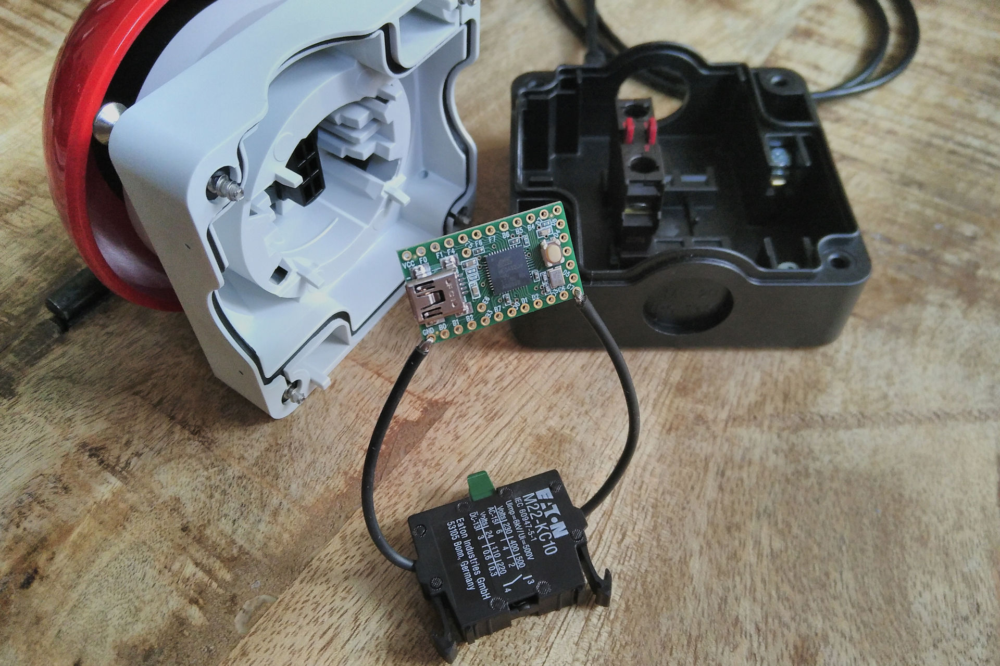
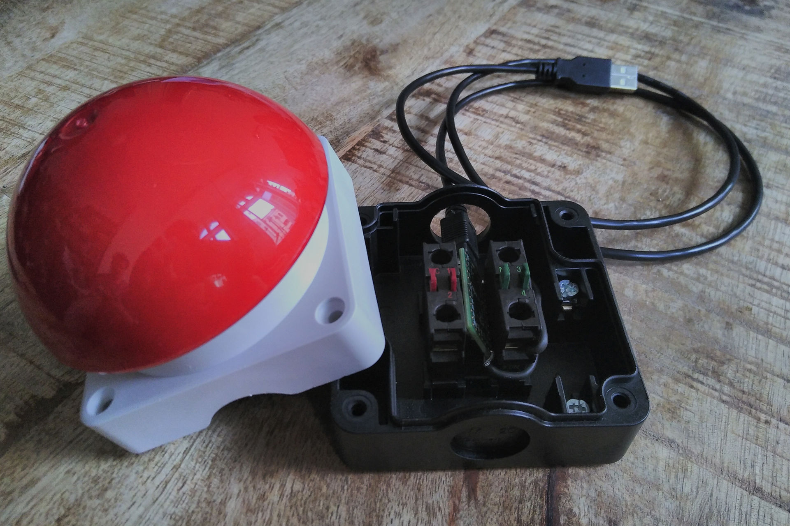

# 🔴 Building a big button

For [🔀 Keep or Sweep](http://keeporsweep.net) or whatever you can imagine. 😊

Inspired by the [awesome button](https://makezine.com/projects/the-awesome-button/) and [The Button](http://rasterweb.net/raster/2011/05/09/the-button/).

## Supplies to order

- **[🔴 Eaton FAK-R/KC11/I big red button](https://ecat.eaton.com/catalog?deeplink=jkfk5)** (for ~37 € at [Voelkner](https://www.voelkner.de/products/144409/Eaton-FAK-R-KC11-I-Fuss-Grobhandtaster-230-V-AC-6A-1-x-Aus-Ein-IP67-tastend-1St..html), goes for ~70 € elsewhere) – or [3D print it yourself!](https://www.thingiverse.com/thing:1406545)
- **[📻 Teensy 2.0 microcontroller](https://pjrc.com/store/teensy.html)**
- **🔌 Mini-USB to USB cable** (as Teensy 2.0 uses Mini-USB)
- **🐍 ~10 cm of wire** (to connect Teensy to switch)
- optional: [Rubber feet (like 3M SJ5012)](http://solutions.3m.com/wps/portal/3M/en_EU/Bumpon/Adhesive-Bumpers/Products/Catalogue/~/3M-Bumpon-Protective-Products-SJ5012-Black-3000-per-case?N=8697097%203294857473%204294920979&rt=d&MDR=true) (for better stability)
- optional: [Cable bushing (like 12mm EAN 2050000168062)](https://www.voelkner.de/products/39731/Kabeldurchfuehrung-Klemm-max.-12mm-PVC-Schwarz-1St..html) (for nicer look)
- optional: Two component glue (to fix the USB cable to the cable bushing)

I ordered everything at [Voelkner](https://www.voelkner.de/), and got 2 of each to have separate buttons for [🔵Keep or 🔴Sweep](http://keeporsweep.net).

## Tools you need

- **💻 Computer** to get the code onto the Teensy
- **🛠️ Screwdriver** to close the button casing
- optional: Soldering iron if you want to fix the connections properly

## Steps to build

1. **[Install Arduino and Teensyduino](https://www.pjrc.com/teensy/tutorial.html)** on your computer. In the process you will connect the Teensy to your computer.

2. **Connect the switch** in the button (I used the green one) to the Teensy using wires like this – one wire to GND, the other to C7:

(Optionally solder these connections. Based on wiring of [The Button / Another Button](http://rasterweb.net/raster/2011/06/27/another-button/).)

3. **Get the code** for [Keep.ino (Space)](https://github.com/keeporsweep/keeporsweep.net/blob/master/button/Keep.ino) or [Sweep.ino (Delete)](https://github.com/keeporsweep/keeporsweep.net/blob/master/button/Sweep.ino), modify if needed, and transfer it to your Teensy with Arduino & Teensyduino. (Based on the code from [The Button](http://rasterweb.net/raster/2011/05/09/the-button/).)

4. **Test** if everything works, put the switch and Teensy in the casing, and screw the top half on:

5. Optional: Put on the rubber feet and the cable bushing for nicer finish.

**And you should be done with your plug-and-play button! 🎉**

